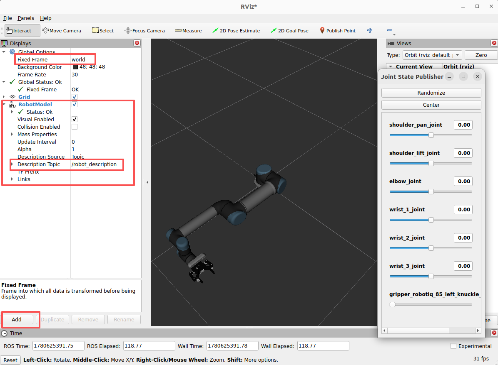

## 搭建UR5+robotiq2f_85+realsense D455 URDF

### 环境配置
1. 系统环境配置
- ubuntu24.04

2. 软件环境配置
- ros2 jazzy
- ros-jazzy-xacro
- ros-jazzy-joint-state-publisher-gui


### 编译
1. 下载当前仓库代码
```
git clone git@github.com:WAI-f/ur_robotiq_realsense_description.git
git submodule update --init --recursive
```
2. 编译代码
```
cd ur_robotiq_realsense_description
colcon build
```

### 可视化
- 激活工作空间的环境变量
```
source install setup.bash
```
- 可视化urdf
```
ros2 launch ur5_robotiq85_rsd455_description display.launch.py
```


### 说明
1. ur直接使用的是Universal_Robots_ROS2_Description仓库源码，分支是jazzy，可以根据使用ros2版本做调整
2. robotiq仓库包含多个ros2 packages，但是这里只将robotiq_description包单独拿出来做编译，这个package包含了robotiq urdf的定义
3. realsense仓库也包含多个ros2 package，这里只用了realsense2_description

### 参考
- UR description参考仓库：[Universal_Robots_ROS2_Description](https://github.com/UniversalRobots/Universal_Robots_ROS2_Description/tree/jazzy)


- robotiq_gripper参考仓库：[ros2_robotiq_gripper](https://github.com/PickNikRobotics/ros2_robotiq_gripper/tree/main)

- realsense参考仓库：[realsense-ros](https://github.com/realsenseai/realsense-ros/tree/ros2-master)